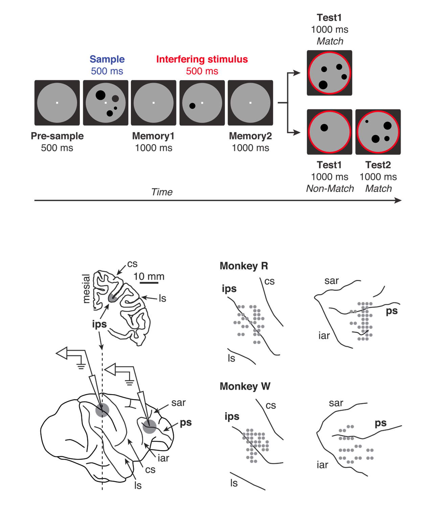
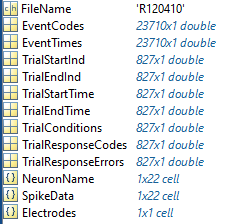
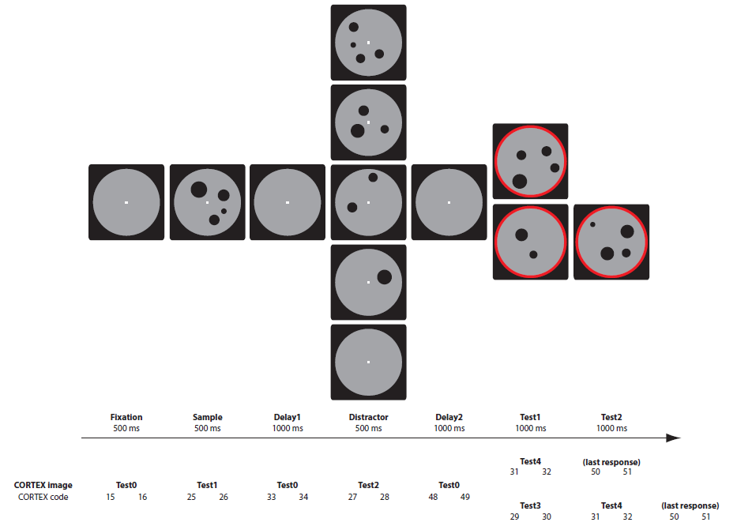
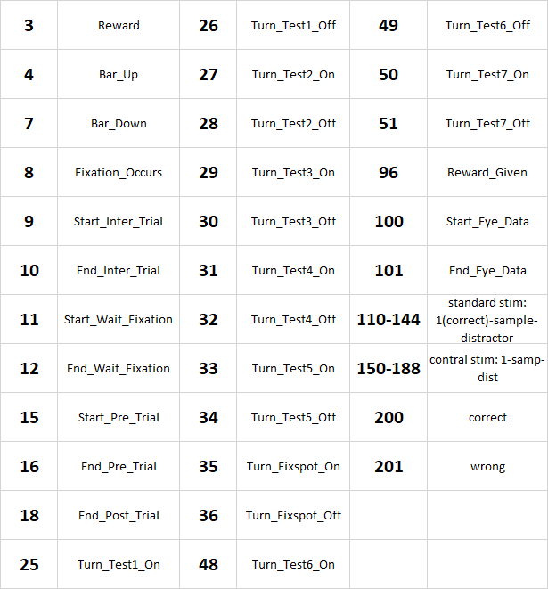
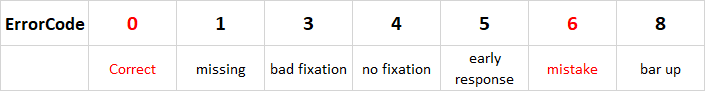

# JacobLab_MonkeySpikes
This repo provides a walkthrough for the sorted unit dataset from Monkey frontoparietal cortex during a numerical working memory task.

# Introduction:
* We trained two rhesus macaque on a delayed-match-to-numerosity task with **1 to 4 dots** as the sample. A task-irrelevant interfering numerosity (1 to 4) was given during the memory delay in 80 % of trials, otherwise, a blank screen with fixation was presented. The behavioral performance of the two monkeys has been reported in detail in our [previous publication](https://www.cell.com/neuron/fulltext/S0896-6273(14)00395-X), showing that both monkeys were able to memorize the sample numerosity despite the interference.
* For the recording, four pairs of electrodes were inserted acutely through selected wells on surgically fixated chambers over the lateral prefrontal cortex (PFC) and the ventral intraparietal cortex (VIP, see lower-right of the figure above). This means up to 8 electrodes in each region during each recording session. 
We recorded in total **616 PFC electrodes** (368 from Monkey R and 248 from W) and **614 VIP electrodes** (376 from R and 238 from W) across **78 sessions** (47 from R and 31 from W).

# The spike data (sorted)
In the dataset I share with you, the spike timestamps of all sorted units are summarized along with necessary behavior timestamps into Matlab `.mat` files. Below I will go through one example session and explain the structure of data.

## The data structure

| Field | Explanation |
| ----- | ----- |
| FileName | `R120410`: `R` or `W` refers to the two monkeys; `120410` is the date for that recording session, thus marking one specific session of a monkey. Note that the recording is done acutely therefore all recording sessions are independent of each other. |
| EventCodes | All behavior events throughout the whole session, check the [event code section](##event-codes) below for more detail. ⚠️ This is not trial segmented. |
| EventTimes | The timestamps for every `EventCodes` corresponding to the field above. Unit: seconds. |
| TrialStartInd | The indices for trial starts, or first event for every trial. For the example session, there are 827 trials (**including invalid**). You will locate the triplet starting timestamp (`EventCode = [9 9 9]`) in the `EventCodes` |
| TrialEndInd | Similar to the field `TrialStartInd`, mark the last event in each trial. `EventCode = [18 18 18]` |
| TrialStartTime | The absolute time of the session for the onset of each trial. |
| TrialEndTime | The absolute time of trial ends. |
| TrialConditions | The condition codes used in MonkeyLogic, not very helpful for you. |
| TrialResponseCodes | ❗ The Sample-Distractor-Test1-Condition for each trial. `0` marks incomplete trials (e.g., trial 1), `2021` (trial 4) means `Sample = 2`; `Distractor = 0` (i.e. no distractor); `Test1 = 2` thus the first test is already a match and monkey should response; if `Test1 != Sample`, then the second test will be equal to the sample, but not labeled in the response code; `Condition = 1` means visual feature controlled stimulus was used, not relevant for you. See [Response Codes section](##response-codes) for more detail. |
| TrialResponseErrors | ❗ The outcome of each trial, correct/error/missing/invalid, etc. See [Error Codes section](##error-codes) for more detail. |
| NeuronName | The number of sorted units in this session. They were named `sig00Xa/b/c`: for the example session, `sig002a` labels the neuron that was recorded from channel `2`, and is the only one in this channel. if both `a` and `b` exist, then two neurons were recorded in this channel. |
| SpikeData | ❗ The spike timestamps for each sorted unit. ⚠️ Not trial segmented, use the `TrialStartTime` and `TrialEndTime` to determine when in each trial the spikes occurred. |
| Electrodes | Not relevant. |

## Event Codes

- note the mistake in legend: `Delay1`: Test5; `Delay2`: Test8; `Last response`: Test7.

## Response Codes
* e.g. **`1210`**: 
    * `1`, sample numerosity, 1-4
    * `2`, distractor numerosity, 0-4, 0(no distractor)
    * `1`, first test numerosity, 1-4, is a match trial if equal to sample
    * `0`, standard stimuli(0) or control stimuli(1)
 
## Error Codes

* `0`, correct/free reward: release bar after a delay from the presentation of match stimuli 
* `6`, mistake: only in a non-match trial, release bar while presenting non-match test
* `1`, missing: possible in all test trials, no response until the end of match stimuli presentation
* `5`, early response: bar release during match_still_waiting delay
* `4`, no fixation: fail to fixate and initiate the trial during wait_fixation
* `8`, bar up: fail to hold the bar to initiate during wait_bar
* `3`, bad fixation: break fixation or release bar during the trial, not in the response period
